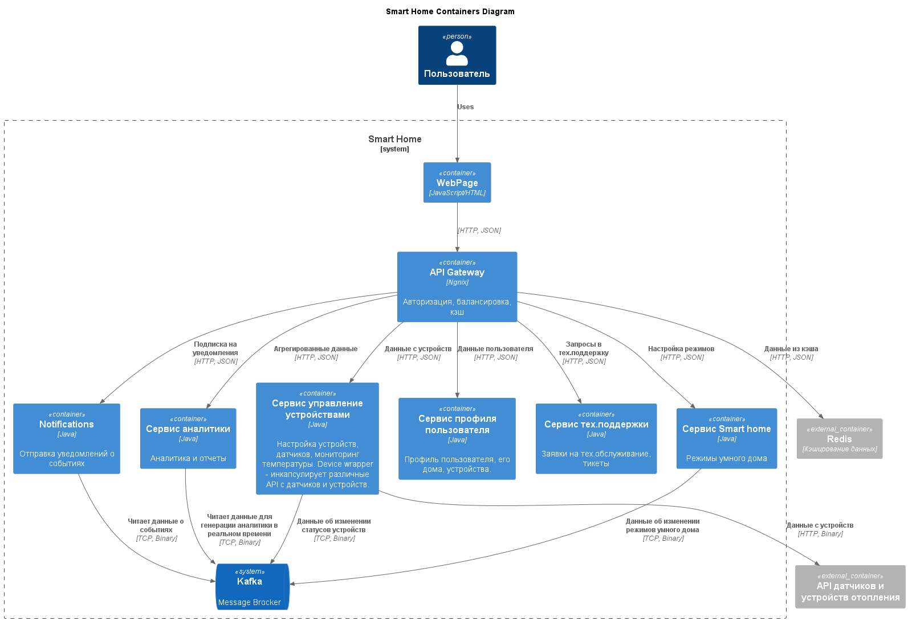
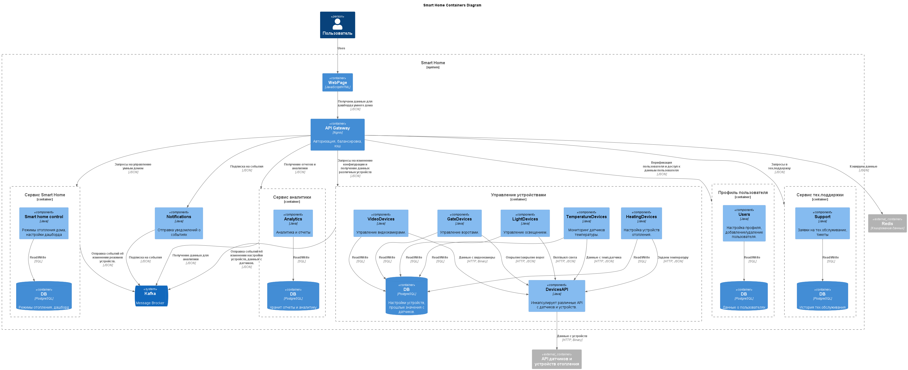

# Спринт 3

## Задание 1. Анализ и планирование

### Функциональность монолитного приложения:
- **Управление отоплением.** Пользователи могут удалённо включать/выключать отопление в своих домах.
- **Мониторинг температуры.** Система получает данные о температуре с датчиков, установленных в домах. Пользователи могут просматривать текущую температуру в своих домах через веб-интерфейс.

### Архитектура монолитного приложения:
- **Язык программирования:** Java
- **База данных:** PostgreSQL
- **Архитектура:** Монолитная, все компоненты системы (обработка запросов, бизнес-логика, работа с данными) находятся в рамках одного приложения.
- **Взаимодействие:** Синхронное, запросы обрабатываются последовательно.
- **Масштабируемость:** Ограничена, так как монолит сложно масштабировать по частям.
- **Развёртывание:** Требует остановки всего приложения.

### Определение доменов и границ контекстов

#### **Управление устройствами**
- Добавить новое устройство может только сотрудник компании.
- Пользователи могут включать/отключать отопление в своих домах.
- Пользователи могут посмотреть данные с устройств.

#### **Управление отоплением**
- Настройка отопления: поддержание заданной пользователем температуры.

### Проблемы монолитного приложения
- Установка приложения и его обновления требуют выезда специалиста на дом. Нет возможности автоматически обновлять приложение.
- Самостоятельно подключить свой датчик к системе пользователь не может. Нет шлюза для спайки нового устройства по сети.
- Сложность масштабирования монолита при росте количество пользователей.
- Данные напрямую запрашиваются из БД, нет кэширования и балансировки.
- Нет информации об уровнях авторизации и безопасности системы.
- При добавлении новых функций, тестирование монолитного приложения займет больше времени. А также придется вручную обновлять все устройства клиентов.

### Диаграмма монолитного приложения

## Задание 2. Проектирование микросервисной архитектуры

### C4 — Уровень контейнеров (Containers)

### C4 — Уровень компонентов (Components)

### C4 — Уровень кода (Code)

Для диаграммы был выбран модуль DeviceAPI Wrapper - сервис, который инкапсулирует API с различных устройств.

## Задание 3. Разработка ER-диаграммы

Для диаграммы были выбраны основные сущности микросервисного приложения: User, PaymentData, House, SmartScenario, SmartScenarioAction, DeviceType, Device.

